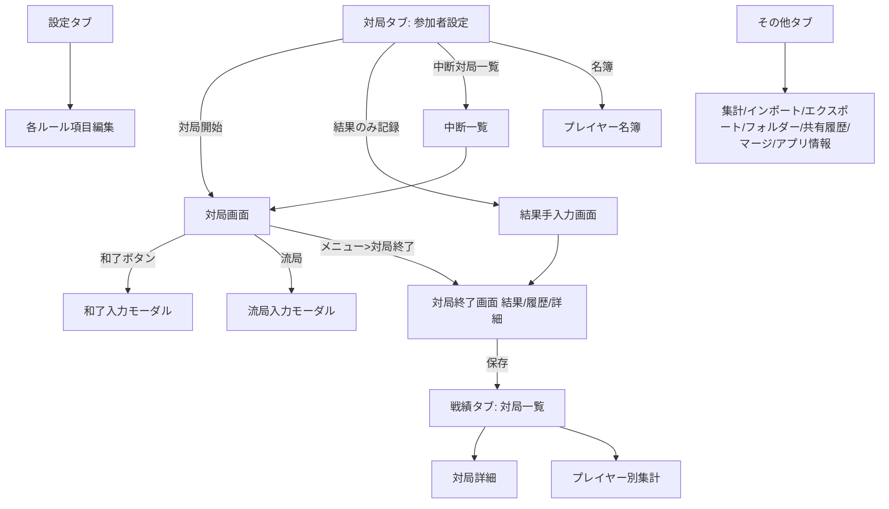

# 麻雀点数記録Webアプリ 要件定義書・設計書

- バージョン: 1.3
- 作成日: 2026-07-18 / 改訂: 2026-07-18
- 改訂履歴 v1.3: ①3人麻雀の空席位置選択(上/左/右)を追加 ②参加者の並び替えを上下ボタン(∧/∨)方式で明文化(全モード共通) ③GameRecordに emptySeatSide を追加
- 改訂履歴 v1.2: 初回実装のレイアウト崩壊を受け対局画面(6.2)を全面詳細化(DOM構造・CSS座標・自己検証チェックリスト)。①±ボタンの機能を「点差表示」に訂正(手動調整は長押し/メニューへ) ②中央ボタンの画面中央配置を明記 ③リーチ棒のビジュアル・配置位置を規定 ④サイコロの振りアニメーション・割れ目決定アクションを追加。受け入れテストE群(レイアウト)追加
- 改訂履歴 v1.1: ①メイン利用形態を「卓中央にスマホ設置・点棒レス運用」に明確化 ②配布形態を単一HTMLファイル+個人サーバーに変更 ③Googleスプレッドシート連携(バックアップ・複数端末共有)を追加(15章) ④和了入力UIを参考スクリーンショットに合わせ詳細化(6.3) ⑤チョンボ・複数和了の仕様追加
- 対象読者: 本書のみを参照して実装を行うAI(コーディングエージェント)
- 本書の位置づけ: 要件定義・仕様・画面設計・データ設計・テスト観点までを含む「実装指示書」。実装者は本書に不明点がある場合、**推測で仕様を変えず、本書のデフォルト値に従うこと。**

---

## 0. このドキュメントの読み方(実装AIへの指示)

1. まず「1. プロジェクト概要」「3. 用語集」を読み、麻雀の精算に関する前提知識を揃えること。
2. 実装順序は「13. 実装フェーズ」に従うこと。フェーズ1(MVP)完了ごとに「14. 受け入れテスト」の該当ケースを必ず検証すること。
3. 点数計算は「8. 点数計算仕様」の数式とテストケースが唯一の正。UI都合で計算を変えないこと。
4. `MUST` = 必須、`SHOULD` = 推奨、`MAY` = 任意(便利機能)。
5. 本アプリは「実際の麻雀卓の横でスマホから点数を記録する」用途。**スマホ縦画面ファースト**で設計すること。

---

## 1. プロジェクト概要

### 1.1 目的
リアル麻雀(手積み/自動卓)のスコア記録・精算・戦績管理を行うWebアプリ。麻雀ゲームそのもの(牌の描画・和了判定)は**実装しない**。プレイヤーが申告した和了・流局・点数を記録し、精算計算と戦績集計を自動化する。

### 1.2 スコープ
- 対局のリアルタイム点数記録(和了・流局・リーチ・本場・供託の管理)
- 3モード対応: **4人麻雀 / 3人麻雀 / 4人3麻**(4人で回す3人打ち。各局1人抜け番)
- ルール詳細設定(ウマ・オカ・端数処理・ノーテン罰符・焼き鳥・賭けレート等)
- 対局結果の保存・戦績一覧・プレイヤー別集計
- Googleスプレッドシートへのバックアップと複数端末間のデータ共有(15章)
- データのエクスポート/インポート(JSONファイル。非常用)
- 途中中断・再開

### 1.3 非スコープ
- オンライン対戦
- 対局中の複数端末リアルタイム同期(対局は卓中央の1台で完結する。共有は保存後の戦績閲覧が対象)
- 牌譜(何を切ったか)の記録
- 和了役の自動判定(役は選択式または符・翻の手入力)

### 1.4 想定ユーザーと利用シーン(重要)
- **メイン利用形態: 全自動雀卓の中央にスマホを1台置き、各プレイヤーが自分の席側から直接操作する。物理点棒は使わず、点棒の授受はすべて本アプリ内で完結する。**
- したがって対局画面は4辺レイアウト(各プレイヤーに正対するよう回転表示)が必須。各自が自席側のボタンだけで「リーチ宣言」「和了宣言」「点数調整」ができること。逆さ・横向きでも押しやすい大型ボタンとする。
- 対局終了後の戦績は、各プレイヤーが自分のスマホからも閲覧できる(スプレッドシート同期。15章)。
- 家族・友人でのセット麻雀。非ガチ層も使う想定 → **操作は大きなボタン・最小タップ数**を最優先。
- 画面スリープ防止(Screen Wake Lock API)を対局中は有効にすること(MUST。非対応ブラウザでは無視してよい)。

---

## 2. 技術スタック(指定)

実装AIは以下を使用すること。代替案の検討は不要。

| 項目 | 指定 |
|---|---|
| 配布形態 | **単一HTMLファイル(index.html)**。CSS/JSはすべて同一ファイル内に記述。ビルドツール(Vite/webpack等)・npm は使用しない |
| 実装言語 | Vanilla JavaScript(ES2020+)。フレームワーク不使用。画面はテンプレート関数+イベント委譲で構築 |
| 外部ライブラリ | CDN読込は Chart.js(グラフ)のみ許可。それ以外は自前実装 |
| スタイル | ファイル内 `<style>` に素のCSS(CSS変数でテーマ定義)。対局画面の回転表示は `transform: rotate()` |
| ローカル保存 | localStorage(進行中対局・設定・対局キャッシュ・同期キュー)。すべてJSON文字列で保存 |
| バックエンド | **Google Apps Script(GAS)ウェブアプリ** + Googleスプレッドシート(15章)。GASコードも成果物として納品する |
| デプロイ | index.html を個人サーバーに配置するだけで動作すること。**HTTPS必須**(fetch・Wake Lockのため) |
| 画面遷移 | ハッシュルーティング(`#/game` 等)による単一ページ内切替 |
| テスト | 点数計算・局進行を**純粋関数群**として実装し、`index.html?selftest=1` でアクセスすると14章のテストケースを自動実行して結果一覧を表示する自己テスト画面を実装(MUST) |
| オフライン | 単一ファイルのためブラウザキャッシュで概ね動作。対局操作はオフラインで完結し、同期のみ通信を要する。PWA化(manifest/Service Worker)はMAY |

設計原則:
- 点数計算・局進行ロジックは `domain` 名前空間の**純粋関数**(入力→出力のみ、DOM非依存)として実装し、UIから分離すること。
- すべての金額・点数は**整数(点)**で内部保持。pt(千点単位)は表示・精算時のみ変換。
- ファイル構成は単一だが、`<script>` 内をセクションコメントで `// ==== domain ==== / // ==== storage ==== / // ==== sync(GAS) ==== / // ==== ui ====` に整理すること。

---

## 3. 用語集(実装AI向け・重要)

| 用語 | 意味 |
|---|---|
| 持ち点 | 各プレイヤーの現在点数。開始時は「最初の持ち点(配給原点)」 |
| 返し点(オカ返し) | 精算基準点。素点 = (最終持ち点 − 返し点) ÷ 1000 |
| 素点 | 上記の千点単位換算値(小数1桁) |
| ウマ | 順位による加減ポイント。例: 4人 `10,5,-5,-10`(1位+10 … 4位−10) |
| オカ | (返し点 − 持ち点) × 人数 ÷ 1000 をトップが総取りするボーナス。例: 25000持ち30000返し4人 → 20pt |
| 本場 | 連荘・流局ごとに増えるカウンタ。1本場につき加算点(例300点)が和了点に上乗せ |
| 供託(リーチ棒) | リーチ宣言で場に出る1000点。和了者が回収 |
| 連荘(レンチャン) | 親が和了(または親テンパイで流局)した場合、親継続で本場+1 |
| 親流れ | 親が和了できず次のプレイヤーに親が移ること |
| ノーテン罰符 | 流局時、ノーテン者がテンパイ者に支払う点。合計点(例3000)を人数で割り勘 |
| 箱下(トビ/ドボン) | 持ち点がマイナスになること。「箱下終了」有効なら即対局終了 |
| 焼き鳥 | 1回も和了できなかったプレイヤーへのペナルティ |
| 頭ハネ | ダブロン時など、上家(ツモ順が近い方)を優先する裁定 |
| チョンボ | 誤ロン等の重大な反則。罰符(通常は満貫相当)を支払い、その局はやり直し |
| ダブロン | 1人の捨て牌に対し2人が同時にロン和了すること(複数和了) |
| 割れ目(割目) | 開局時のサイコロで決まる席の得点授受が2倍になるローカルルール |
| 上家(かみちゃ) | 自分の左隣(ツモ順が1つ前)のプレイヤー |
| 東風戦/半荘戦 | 東場のみ(4局)/東場+南場(8局)の対局長 |
| 西入・北入 | 規定点未達時の延長戦 |
| ツモ損 | 3人麻雀でツモ和了時、不在の1人分の支払いを受け取れないルール |
| 4人3麻 | 4人が交代で3人打ちを行う形式。各局1人が「抜け番」 |

---

## 4. 機能一覧(参考UIスクリーンショットとの対応)

参考アプリの全機能を再現(MUST)+ 提案機能(12章)。

### 4.1 タブ構成(下部固定ナビゲーション、5タブ)
1. **対局** — 参加者設定 → 対局開始 / 結果のみ記録 / 中断対局一覧
2. **設定** — モード別(4人麻雀/3人麻雀/4人3麻)ルール設定、プリセット保存
3. **戦績** — 対局一覧 / プレイヤー別集計、フィルタ・ソート
4. **ストア** — 本Webアプリでは「プレミアム機能」枠は不要。**タブ自体を省略し4タブ構成とする**
5. **その他** — データ管理(集計/インポート/エクスポート/フォルダー/共有履歴/プレイヤーマージ)、アプリ情報

### 4.2 機能一覧表

| ID | 機能 | 優先度 |
|---|---|---|
| F-01 | プレイヤー名簿管理(登録・編集・削除・並び順) | MUST |
| F-02 | 参加者選択と席順(東南西北)設定、上下ボタンによる並び替え、席シャッフル・ローテーション、3人麻雀の空席位置選択 | MUST |
| F-03 | モード選択(4人麻雀/3人麻雀/4人3麻) | MUST |
| F-04 | 対局画面: 4方向レイアウトの点数表示・和了/リーチ/点数調整ボタン | MUST |
| F-05 | 和了入力(ロン/ツモ、翻・符選択 or 直接点数入力、点数早見) | MUST |
| F-06 | リーチ宣言(供託管理、持ち点−1000、取消可) | MUST |
| F-07 | 流局処理(テンパイ者選択→ノーテン罰符自動精算) | MUST |
| F-08 | 局進行(本場・連荘・親流れ・供託繰越の自動管理) | MUST |
| F-09 | 手動点数調整(±ボタン長押し or メニューから。任意授受・メモ付き) | MUST |
| F-10 | 局履歴表示と**取り消し(Undo)** | MUST |
| F-11 | 対局終了(規定局数/箱下/手動)→ 結果画面(素点・ウマ・オカ内訳) | MUST |
| F-12 | 対局中メニュー: 終了/ヘルプ/履歴/対局情報修正/対局中設定/席の移動 | MUST |
| F-13 | 結果保存・破棄、フォルダー分類、共有(エクスポート) | MUST |
| F-14 | 結果のみ記録(対局せず最終点数だけ入力して精算・保存) | MUST |
| F-15 | 対局の中断・再開(中断対局一覧) | MUST |
| F-16 | 戦績: 対局一覧(モードフィルタ、日付・時間・所要分・順位表) | MUST |
| F-17 | 戦績: プレイヤー別集計(対局数/合計pt/総収支¥/平均順位、ソート) | MUST |
| F-18 | 集計画面(期間・プレイヤー・モード絞り込み集計) | SHOULD |
| F-19 | 対局データのエクスポート/インポート(JSONファイル)、共有履歴 | MUST |
| F-20 | プレイヤーのマージ(表記ゆれ統合、戦績引き継ぎ) | MUST |
| F-21 | ルール設定(7章の全項目)+ プリセット保存/読込(ブックマーク機能) | MUST |
| F-22 | 点数推移グラフ(結果画面「詳細」タブ) | MUST |
| F-23 | 賭けレート精算(pt→円換算)、チップ精算 | MUST |
| F-24 | 言語切替(日本語/英語)。初期実装は日本語のみ、i18n構造だけ用意 | SHOULD |
| F-25 | ヘルプ(操作説明モーダル) | SHOULD |
| F-26 | チョンボ入力(罰則精算・同一局やり直し)、複数和了(ダブロン)入力 | MUST |
| F-27 | Googleスプレッドシート同期(バックアップ・複数端末共有。15章) | MUST |
| F-28 | 対局中の画面スリープ防止(Wake Lock) | MUST |
| F-29 | 点差表示(±ボタンタップで他プレイヤーとの点差をその席の向きで表示) | MUST |
| F-30 | サイコロ演出(振りアニメ+出目表示)と割れ目席の決定 | MUST |

---

## 5. 画面一覧・遷移



ルーティング(ハッシュ方式):
`#/` (対局設定) `#/game` `#/result` `#/records` `#/records/:id` `#/players-stats` `#/settings` `#/misc` `#/misc/aggregate` ほか。ブラウザバックで画面が戻れること。

---

## 6. 画面詳細設計

共通: スマホ縦(375–430px)基準。下部タブは対局画面では非表示(全画面)。カラートーンは参考UIに準拠 — 対局画面は緑(雀卓)`#3d9440` 系、その他はライトグレー背景+白カードのiOS風リスト。

### 6.1 対局タブ(参加者設定)【画像12】
- ヘッダー: 「名簿」ボタン(青)/タイトル「参加者」/右に「リセット」「ローテーション(席を1つずらす)」「シャッフル(ランダム席順)」の3アイコンボタン。
- モード切替セグメント: 4人麻雀 / 3人麻雀 / 4人3麻。切替で参加枠が4/3/4人に変化。
- 参加者リスト: 各行に風マーク(東南西北。3麻は東南西)+名前。名前タップで名簿から選択。
- **並び替え(全モード共通・v1.3)**: 各行の右端に上下ボタン「∧」「∨」を常時表示し、タップで1つ上/下の行と入れ替える。先頭行の「∧」と末尾行の「∨」は無効(グレーアウト)。入れ替え後も風は行位置に固定(1行目=東、2行目=南…)。ドラッグ並べ替えはMAY。
- **空席位置の選択(3人麻雀のみ・v1.3)**: リスト下部に「空席」チップボタンを表示(例「🪑 空席 上」)。タップで **上 → 左 → 右** を巡回切替(デフォルト: 上)。対局画面では選択した辺を空席とし、残り3辺にプレイヤーを配置する(下=リスト1番目は固定)。4人麻雀・4人3麻では非表示。
- 注記表示: 「一番上のプレイヤーが対局画面の下側(自分位置)に配置されます」。
- 下部ボタン: 「結果のみ記録」「中断対局一覧」(半透明)、「対局開始」(青・大)。
- バリデーション: 全席にプレイヤー設定済みでないと対局開始不可。同一プレイヤー重複不可。

### 6.2 対局画面【画像16準拠・v1.2で詳細化】
最重要画面。**v1.2注記: 初回実装でレイアウト崩壊(パネルが分解して円ボタンだけが散らばる・中央ボタンが左上に配置される等)が発生したため、本節の構造とCSSを厳守し、6.2.7のチェックリストで自己検証すること。**

#### 6.2.1 全体構造(DOM)
画面は `position: relative` の全画面コンテナに、以下を配置する:

```
┌─────────────────────────────────┐
│ [履歴] [経過時間] [東1局 0本場 供託0本] [🎲] [⋯] │ ← 上部バー(回転なし)
│         ┌───────────────┐        │
│         │  北側パネル(180°回転) │        │
│         └───────────────┘        │
│ ┌─────┐                 ┌─────┐ │
│ │西側    │   ┌─────────┐   │東側    │ │
│ │パネル  │   │ 中央ボタン     │   │パネル  │ │
│ │(90°)  │   │ 流局/複数和了/ │   │(-90°) │ │
│ │       │   │ チョンボ       │   │       │ │
│ └─────┘   └─────────┘   └─────┘ │
│         ┌───────────────┐        │
│         │  南側パネル(自席・回転なし)│        │
│         └───────────────┘        │
└─────────────────────────────────┘
```

- **中央ボタンは必ず画面中央**(`left:50%; top:50%; translate(-50%,-50%)`)。卓の中心=物理的に全員の手が届く位置。ラベル「流局/複数和了/チョンボ」または牌卓アイコン。タップで6.3-Bのメニュー。
- パネルは**1つの `.seat` コンテナごと回転**させる。パネル内部の要素(ボタン・黒帯・バッジ)を個別に配置・回転してはならない(初回実装の失敗原因)。

#### 6.2.2 席パネルの配置とCSS(この通りに実装)
```css
.seat        { position:absolute; width:min(88vw, 46vh); }
.seat.bottom { bottom:12px; left:50%; transform:translateX(-50%); }
.seat.top    { top:64px;   left:50%; transform:translateX(-50%) rotate(180deg); }
.seat.left   { left:0;  top:50%; transform-origin:center;
               transform:translate(calc(-50% + 52px), -50%) rotate(90deg); }
.seat.right  { right:0; top:50%; transform-origin:center;
               transform:translate(calc(50% - 52px), -50%) rotate(-90deg); }
```
- 検証ルール: **各パネルの文字は、その辺の外側に座っている人から見て正立**していること(上=逆さ、左右=横向き)。
- 左右パネルは回転後、縦の帯として画面端に沿う。回転後の占有幅(=パネルの高さ約104px)が中央ボタンと重ならないこと。
- 3人麻雀時は、参加者設定で選んだ**空席位置(上/左/右。6.1)を除いた3辺**に配置する(下=自席は常に固定。例: 空席=上なら 下・左・右)。4人3麻時は3辺+抜け番の小型パネル(右下、回転なし、点数表示のみ)。

#### 6.2.3 席パネルの内部構造(DOM順、上から)
```html
<div class="seat bottom">
  <div class="badges">   <!-- 卓中央側の行 -->
    風マーク(東南西北) 起家マーク 焼き鳥マーク(未和了の間) リーチ棒表示エリア
  </div>
  <div class="scorebar"> <!-- 黒帯 -->
    👑(トップのみ) 名前 <span class="pts">25000</span> [±ボタン(青)]
  </div>
  <div class="actions">  <!-- 外側=プレイヤーの手元側の行 -->
    [和了ボタン(青・牌アイコン)] [リーチボタン(赤・点棒アイコン)]
  </div>
</div>
```
ボタンは最小56×56px。黒帯は角丸・持ち点は黄色数字。

#### 6.2.4 ±ボタン=点差表示(v1.2で仕様確定・重要)
- **±ボタンのタップは手動点数調整ではない。「そのプレイヤーと他の各プレイヤーとの点数差」を表示する機能**である(オーラスの逆転条件確認などに使う)。
- タップ → そのパネルの上に点差オーバーレイを表示(押した席の向きに回転):
  - 他プレイヤーごとに1行: 「相手名 +8,200」形式。値 = 自分の持ち点 − 相手の持ち点(正=リード・青、負=ビハインド・赤)。
  - 再タップ・他所タップ・5秒経過で閉じる。
- **手動点数調整(F-09)は ±ボタンの長押し(500ms)**、または対局中メニュー「点数調整」から開く。調整モーダル=対象プレイヤー(長押し元をプリセット)+テンキー+±切替+理由メモ(任意)。

#### 6.2.5 リーチ宣言とリーチ棒の表示(v1.2で明確化)
- 赤ボタンタップ → 即時: 宣言者 −1,000点、ヘッダーの供託 +1本。再タップで取消(同一局内のみ、逆処理)。
- **リーチ棒のビジュアル**: CSSで描画した**横長の白い点棒**(角丸長方形 約64×10px、中央に赤い丸 直径6px。`<div class="riichi-stick">` + 疑似要素で赤丸)。絵文字・縦置きは不可。
- **置く位置**: 宣言者パネルの `.badges` 行(=卓中央側、パネルと中央ボタンの間)。パネル内に置くことで席の回転に自動追従し、実卓でリーチ棒を自分の河の手前に横向きに置く見た目を再現する。
- 和了確定時に全リーチ棒表示を消去し供託を和了者へ。流局時は棒表示を消し供託数のみ次局へ繰越。

#### 6.2.6 サイコロ(v1.2でアクション仕様追加)
- 上部バーのサイコロボタンをタップ → 卓中央にダイス2個のオーバーレイを表示し、**振りアニメーション**(約0.8秒、出目を高速切替 or CSS回転)→ 各1〜6の乱数で停止し、出目と合計を大きく表示(例「3・5 = 8」)。
- 表示は2秒後またはタップで閉じる。アニメーション中の再タップは無効。
- 用途: 親決め・割れ目決定。設定「割目時の得点倍率」有効時は、出目確定後に「この出目で割れ目を設定しますか?」→「はい」で**起家の席から反時計回りに合計数だけ数えた席**を割れ目とし、該当パネルに「割」バッジを表示。以後その席が絡む授受を2倍(7.5)。
- 出目は演出であり局履歴には記録しない。

#### 6.2.7 レイアウト自己検証チェックリスト(実装AIは実装後に必ず確認)
1. 4つのパネルが上下左右の4辺に1つずつ、崩れず矩形のまま配置されている(要素がバラけていない)。
2. 中央ボタンが画面のほぼ中央にあり、全パネルと重なっていない。
3. 上パネルは180°、左右は±90°回転し、各辺の外側から読める向きになっている。
4. 375×667px(iPhone SE)でも要素が重ならない。
5. リーチ宣言でそのパネルの卓側に横向き点棒が表示される。
- その他: 最上部中央に局表示バッジ「東1局 0本場 供託0本」(タップで局情報詳細)、左上に履歴ボタン+経過時間、右下に「…」→対局中メニュー(6.5)。
- 3人麻雀時は空席位置設定に従った3辺配置(6.2.2)。4人3麻時は抜け番プレイヤーを右下隅に小さく表示し、局終了ごとに自動交代(交代順: 起家→南→西→北の順に抜け)。

### 6.3 和了入力フロー【和了UIスクリーンショット準拠】

**A) 起点1: 各プレイヤーの青ボタン(牌アイコン)タップ → アクションシート**
- タイトル: 押したプレイヤー名(例「伊藤栄」)
- 注記文を表示: 「流局・複数和了・チョンボは中央ボタンから入力できます。」
- 選択肢(大型ボタン縦並び): 「ツモ」/「ロン」/「キャンセル」
- ツモまたはロン選択 → 和了入力シートへ(和了者・形式をプリセット済み)
- シートは**押した席の向きに合わせて回転表示しない**(操作者が手元に取って入力する想定で常に下向き=通常向きで表示してよい。MAY: 設定で「押した席向きに回転」を選択可)

**B) 起点2: 中央ボタン → メニュー**
- 「流局」(→6.4)/「複数和了(ダブロン)」/「チョンボ」/「キャンセル」

**和了入力シート(全画面ボトムシート)**
- ヘッダー: 左に「×」閉じる / 中央タイトル「和了入力」
- サマリーカード(折りたたみ可能。ヘッダー行は常時表示):
  - ヘッダー行表示例: ツモ時「伊藤栄 [ツモ](緑バッジ)」/ロン時「伊藤栄 [ロン](赤バッジ) ← いっせい」
  - 展開時の内容:
    - 「和了者」ラベル+全参加者のチップ(単一選択、選択中は青)
    - 「ツモ/ロン」セグメントトグル
    - ロン選択時のみ「放銃者」ラベル+参加者チップ行を追加表示(和了者本人はグレーアウトで選択不可)
- 「点数」セクション: アコーディオンリスト
  - 項目: 「1翻」「2翻」「3翻」「4翻」(タップで展開)+「満貫」「跳満」「倍満」「三倍満」「役満」「ダブル役満」「トリプル役満」(直接選択行)
  - 各翻を展開すると符の行を表示。**有効な組合せのみ**: 1翻=30〜110符 / 2翻=20〜110符・25符 / 3翻=20〜60符・25符 / 4翻=20〜30符・25符(それ以上は満貫のため非表示。切り上げ満貫設定有効時は4翻30符等も満貫表示)
  - **各行の右端に、現在選択中の文脈(和了者が親か子か×ツモかロンか)での支払額を表示**:
    - ロン: 放銃者の支払総額。例「1,500点」
    - 親ツモ: 全員払い額+「∀」記号。例「700∀」(=700点オール)
    - 子ツモ: 「子払い/親払い」形式。例「400/700」
    - 表示額は8.2の計算式で動的算出(本場加算分は含めず、確定時に別途加算)
  - **行タップで即確定**(確認ダイアログなし。スピード優先、誤操作はUndoで救済)
- 確定時処理: 点数授受+本場加算(設定値×本場数)+供託全回収+焼き鳥フラグ解除+連荘/親流れ判定(9章)+次局へ自動進行し対局画面へ戻る
- SHOULD: 確定直後、対局画面に授受サマリをトースト表示(例「伊藤栄 +12,300 / いっせい −12,300(本場600・供託1,000含む)」)

**複数和了(ダブロン/トリプルロン)**
- 中央ボタン→「複数和了」: ①放銃者を1名選択 ②和了者を複数選択 ③和了者ごとに点数(翻・符)を順に入力
- 供託: 設定「立直棒の受取者」に従う。頭ハネ=放銃者から反時計回りに最も近い和了者のみ獲得/全員=按分せず各自の宣言棒のみ回収し場の供託は頭ハネ者
- 本場加算: 頭ハネの和了者のみ受け取る
- 親が和了者に含まれれば連荘

**チョンボ**
- 中央ボタン→「チョンボ」: 違反者を1名選択 → 罰則プレビュー表示 → 確定
- 罰則方式(設定「細かなルール」に項目追加): **満貫払い(デフォルト)**=違反者が親なら他家へ各4,000点、子なら親へ4,000点・他の子へ各2,000点/固定点数/精算時pt減算(−N pt)
- 局処理: **同一局をやり直す**(局・本場・親は据置き。当局中のリーチ宣言棒は宣言者へ返却し供託から除く)。チョンボは局履歴に記録し、プレイヤー統計のチョンボ回数に計上

### 6.4 流局入力モーダル
- 中央ボタン→「流局」から開く。
- 各プレイヤーの「テンパイ/ノーテン」をトグル選択。
- ノーテン罰符を設定(例: 総額3000点)に基づき自動授受(8.4)。全員テンパイ/全員ノーテンは授受なし。
- 特殊流局(九種九牌・四風連打など)ボタン: 罰符なし・本場+1のみ。SHOULD。
- 親テンパイなら連荘、親ノーテンなら親流れ。いずれも本場+1。リーチ供託は次局へ繰越。

### 6.5 対局中メニュー【画像1】
右下「…」から放射状(または縦リスト)に表示: **対局終了 / ヘルプ / 対局履歴 / 点数調整(手動点数調整モーダル。6.2.4) / 対局情報修正(日時・メモ・参加者名) / 対局中設定(ルールの一部を途中変更。ウマ・レート等の精算系のみ可) / 席の移動(席順入替) / 閉じる**。

### 6.6 局履歴シート & Undo
- 局ごとの出来事を時系列リスト表示(例: 「東1局 いっせい ロン 伊藤栄 3900+300」)。
- 最新イベントから順に「取り消し」可能(MUST)。イベントソーシング方式(10章)で実装。

### 6.7 対局終了画面【画像13,14,15】
- ヘッダー: 「対局終了」/右に 編集(対局情報修正)・フォルダー追加・共有(エクスポート)。日時表示。
- タブ: **結果 / 履歴 / 詳細**。
  - 結果: 表示切替「リスト/表」。リストは順位バッジ+名前+最終持ち点+合計pt(大)+内訳(素点/ウマ/オカ/焼き鳥/チップ)。賭け有効時は円換算も表示。焼き鳥該当者にアイコン。
  - 履歴: 局履歴(なければ空状態イラスト+「履歴がありません」)。
  - 詳細: 「点数の推移」折れ線グラフ(X軸=局、Y軸=持ち点、プレイヤー別色分け・凡例)。プレイヤー別タブで個人統計(和了回数・放銃回数・リーチ回数)。
- 下部: 「保存」(青・大)/「破棄」(赤文字)。破棄は確認ダイアログ必須。

### 6.8 設定タブ【画像6〜11】
- モード切替セグメント(4人麻雀/3人麻雀/4人3麻)。**設定はモードごとに独立保存。**
- 右上: プリセット一覧アイコン・ブックマーク保存アイコン(現在の設定に名前を付けて保存/呼出)。
- セクション折りたたみ式リスト(項目は7章)。各行=項目名+現在値(青文字)+「>」。タップで選択シート。

### 6.9 戦績タブ【画像4,5】
- 上部トグル: 「対局一覧」「プレイヤー」。
- フィルタチップ: まとめる(全モード)/4人麻雀/3人麻雀/4人3麻。右端に件数「10/10件」。
- ヘッダーアイコン: カレンダー(期間フィルタ)/フィルタ/ソート/選択モード(複数選択→削除・フォルダー移動・エクスポート)。
- 対局一覧: カード=日付・開始時刻・所要分・通し番号(MF10等)・モードバッジ+順位表(名前/持ち点/pt。ptは正=青、負=赤)。タップで対局詳細(6.7と同構成の閲覧画面)。
- プレイヤー: 行=名前・対局数/列=ポイント・総収支(¥)・平均順位。列ヘッダタップでソート。

### 6.10 その他タブ【画像2,3】
- データ: 集計 / 対局データをインポート / 対局データを送信(エクスポート) / フォルダー / 共有履歴 / プレイヤーのマージ。
- アプリ: 言語 / お知らせ / 更新履歴。サポート: 開発者に連絡 / プライバシーポリシー / 利用規約 / ライセンス。(Webでは静的ページ・外部リンクで可)

---

## 7. ルール設定仕様(全項目)

モードごとに独立した設定オブジェクトを持つ。**デフォルト値は下表の通り**(参考UIの値に準拠)。

### 7.1 対局進行
| 項目 | 選択肢 | 4麻デフォルト | 3麻デフォルト | 4人3麻デフォルト |
|---|---|---|---|---|
| 対局の長さ | 東風戦 / 半荘戦 / 一荘戦 | 東風戦 | 東風戦 | 東風戦 |
| 延長戦(西・北入)の有無 | 無効 / 有効(規定点: 30000等を設定) | 無効 | 無効 | 無効 |
| 箱下終了の有無 | 有効(0点未満で即終了) / 無効(マイナス続行) | 有効 | 有効 | 有効 |

### 7.2 点数
| 項目 | 内容 | 4麻 | 3麻 | 4人3麻 |
|---|---|---|---|---|
| 最初の持ち点 | 配給原点 | 25,000 | 30,000 | 30,000 |
| 返す点数 | 精算基準点 | 30,000 | 35,000 | 35,000 |
| ノーテン罰符の総点 | ノーテン者で総額を割り勘して支払い | 3,000 | 2,000 | 2,000 |
| 本場設定 | 1本場あたり加算点(和了点に上乗せ)。ツモ時は支払者で割り勘 | 300点/本場 | 200点/本場 | 200点/本場 |
| 焼き鳥関連設定 | 無効 / 有効(ペナルティpt: 例10pt。精算時に未和了者→和了者へ) | 無効 | 無効 | 無効 |

### 7.3 結果関係
| 項目 | 内容 | 4麻 | 3麻 | 4人3麻 |
|---|---|---|---|---|
| ウマ | 順位ポイント配列(合計0でなくても可、そのまま加算) | 10, 5, -5, -10 | 15, -5, -10 | 15, -5, -10 |
| 最終点数の端数処理 | 四捨五入 / 五捨六入 / 切り捨て / 切り上げ / 処理なし(小数1桁) | 四捨五入 | 四捨五入 | 四捨五入 |
| 箱下ボーナスの有無 | 有効時: 飛ばした者に+Npt、飛んだ者に−Npt | 無効 | 無効 | 無効 |
| 同点の時の順位 | 上家(起家に近い席)が上位 / 同順位で山分け | 上家が上位 | 上家が上位 | 上家が上位 |

### 7.4 賭け関係
| 項目 | 内容 | デフォルト |
|---|---|---|
| 賭けの有無 | 無効 / 有効(レート: 1pt=N円。例 テンゴ=50円/pt) | 無効(全モード) |
| チップ設定 | 無効 / 有効(初期枚数、1枚=N円、対局中の増減記録) | 無効(全モード) |

### 7.5 細かなルール
| 項目 | 内容 | デフォルト |
|---|---|---|
| 割目時の得点倍率 | 無効 / 2倍(サイコロで決めた割れ目席が絡む授受を倍) | 無効 |
| 箱下時の立直可否 | 無効(1000点未満はリーチ不可) / 有効 | 無効 |
| 親の和了流し | 不要(親和了で連荘) / 有効(親が和了しても親流れ) | 不要 |
| 立直棒の受取者 | 頭ハネで獲得する / 全員が獲得(ダブロン時に供託を按分) | 頭ハネで獲得する |
| 点数表の設定(3麻系のみ) | ツモ損有り / ツモ損無し(北家分を折半加算等) | ツモ損有り |

---

## 8. 点数計算仕様(唯一の正)

### 8.1 内部表現
- 持ち点・授受はすべて**整数(点)**。精算ptは `(点 - 返し点) / 1000` の小数1桁で計算し、最後に端数処理。

### 8.2 符・翻 → 基本点
```
基本点 = 符 × 2^(2 + 翻)   ただし上限あり
支払い:
  子ロン   = 基本点×4   親ロン   = 基本点×6
  子ツモ   = 親が基本点×2、他の子が基本点×1 ずつ
  親ツモ   = 全子が基本点×2 ずつ
すべて100点単位に切り上げ。
上限(基本点):
  2000=満貫(基本点が2000超になる組合せ、および翻数5)
  3000=跳満(6-7翻) 4000=倍満(8-10翻) 6000=三倍満(11-12翻) 8000=役満(13翻〜)
  ※4翻30符・3翻60符は「切り上げ満貫」設定(MAY、デフォルト無効)
役満はN倍役満まで対応(基本点8000×N)。
```
- 3人麻雀ツモ損有り: ツモ時、不在プレイヤー分は受け取らない(2人分のみ)。ツモ損無し: 不在分を折半して2人に上乗せ。
- 本場加算: ロン=放銃者が `本場点×本場数` 追加払い。ツモ=支払者全員で `本場点×本場数` を割り勘(割り切れない分は100点単位で切り上げず、割り勘設定に従い均等・端数は上家負担)。

### 8.3 リーチ・供託
- リーチ宣言: 宣言者 −1000点、供託 +1本。局内取消可(逆処理)。
- 和了時: 和了者が供託全額(1000×本数)を獲得。流局時: 供託は次局へ繰越。対局終了時に供託が残る場合: **トップが獲得**(MUST。設定で「そのまま消滅」も選択可 MAY)。

### 8.4 流局(ノーテン罰符)
```
総額P(例3000)、テンパイ者t人、ノーテン者n人(t+n=参加人数、t=0またはn=0なら授受なし)
ノーテン者: 各 −P/n   テンパイ者: 各 +P/t
100点未満の端数が出る組合せは発生しない前提だが、割り切れない場合は100点単位で丸め、差分は上家優先で調整。
```

### 8.5 最終精算(pt計算)
```
1) 素点_i = (最終持ち点_i − 返し点) / 1000        …小数1桁
2) 順位決定: 持ち点降順。同点は「同点の時の順位」設定(デフォルト: 起家から数えて席順が早い方が上位)
3) ウマ_i = ウマ配列[順位_i]
4) オカ = (返し点 − 最初の持ち点) × 参加人数 / 1000 …1位のみ加算
5) 焼き鳥・箱下ボーナス・チップptを設定に応じ加算
6) pt_i = 素点_i + ウマ_i + (1位ならオカ) + 補正
7) 端数処理を各pt_iに適用。合計が0にならない場合、差分を1位に加減して合計0を保証する(MUST)
8) 賭け有効時: 円_i = pt_i × レート。チップ: (最終枚数−初期枚数) × 単価
```

### 8.6 計算テストケース(自己テスト画面 `?selftest=1` で実装必須)

**TC-1(参考UI実測値・4人麻雀 25000持ち/30000返し、ウマ10,5,-5,-10、四捨五入)**
| プレイヤー | 最終持ち点 | 素点 | ウマ | オカ | 期待pt |
|---|---|---|---|---|---|
| 伊藤栄(1位) | 51,900 | +21.9 | +10 | +20 | **+52.0** |
| いっせい(2位) | 29,300 | −0.7 | +5 | — | **+4.0** |
| しんご(3位) | 20,800 | −9.2 | −5 | — | **−14.0** |
| ゆうすけ(4位) | −2,000 | −32.0 | −10 | — | **−42.0** |
合計 = 0 を検証。

**TC-2(開始直後終了・全員25,000点、同点は席順)**
1位(起家) 素点−5+ウマ10+オカ20=+25.0 / 2位 0.0 / 3位 −10.0 / 4位 −15.0。合計0。

**TC-3(3人麻雀 30000持ち/35000返し、ウマ15,-5,-10)**
オカ = 5000×3/1000 = 15pt を1位に加算することを検証。

**TC-4(符翻)** 子ロン30符4翻=7700 / 親ロン30符4翻=11600 / 子ツモ25符3翻=1600-800 / 5翻=満貫(子8000/親12000) / 13翻=役満(子32000/親48000)。

**TC-5(本場・供託)** 2本場・供託2本で子ロン3900 → 放銃者−(3900+600)、和了者+3900+600+2000。

**TC-6(流局)** 4人中テンパイ1人: テンパイ者+3000、ノーテン3人 各−1000。

---

## 9. 局進行ロジック(状態遷移)

```
[対局開始] 局=東1、本場=0、供託=繰越なし、起家=席順1番目
  │
  ├─ 和了(ロン/ツモ)
  │    ├ 和了者に親が含まれる かつ 親の和了流し=不要 → 連荘(局据置き、本場+1)
  │    └ それ以外 → 親流れ(局+1、本場=0)
  ├─ 流局 → 本場+1、親テンパイなら局据置き、親ノーテンなら局+1
  │
  └─ 各局終了後に終了判定:
       a) 箱下終了=有効 かつ 誰かの持ち点<0 → 即終了
       b) 規定局消化(東風=東4終了、半荘=南4終了)
          ├ 延長戦=有効 かつ 全員が規定点未満 → 西入(南4→西1)、以降誰かが規定点到達した局で終了
          └ それ以外 → 終了
       c) メニューから手動終了 → 終了確認 → 対局終了画面へ
※ オーラス親和了時の「和了やめ」: 終了確認ダイアログで「続行(連荘)/終了」を選択させる(MUST)
※ 4人3麻: 局開始時に抜け番を自動ローテーション。抜け番者の持ち点は据置き
```

すべての状態変更は**イベント**(RIICHI / WIN / DRAW / ADJUST / SEAT_MOVE / …)として追記記録し、現在状態はイベント列のリプレイで導出する。Undo=末尾イベント削除+再リプレイ。

---

## 10. データモデル(TypeScript)

```ts
type GameMode = 'yonma' | 'sanma' | 'yonin_sanma';

interface Player { id: string; name: string; createdAt: number; archived?: boolean; }

interface RuleSet {
  mode: GameMode;
  length: 'tonpu' | 'hanchan' | 'iichan';
  extension: { enabled: boolean; threshold: number };
  bustEnd: boolean;                      // 箱下終了
  startPoints: number;                   // 最初の持ち点
  returnPoints: number;                  // 返す点数
  notenPenaltyTotal: number;             // ノーテン罰符総点
  honbaValue: number;                    // 1本場あたり点
  yakitori: { enabled: boolean; penaltyPt: number };
  uma: number[];                         // 例 [10,5,-5,-10]
  rounding: 'round' | 'round56' | 'floor' | 'ceil' | 'none';
  bustBonus: { enabled: boolean; pt: number };
  tieBreak: 'seatOrder' | 'split';
  bet: { enabled: boolean; ratePerPt: number };
  chip: { enabled: boolean; initial: number; valuePerChip: number };
  wareme: boolean;
  riichiUnderZero: boolean;              // 箱下時の立直可否
  dealerWinRotates: boolean;             // 親の和了流し
  riichiStickReceiver: 'atamahane' | 'all';
  tsumoLoss: boolean;                    // 3麻系のみ
}

interface Seat { playerId: string; wind: 'E'|'S'|'W'|'N'; }

type GameEvent =
  | { type: 'RIICHI'; seat: number }
  | { type: 'RIICHI_CANCEL'; seat: number }
  | { type: 'WIN'; winners: { seat: number; han?: number; fu?: number; directPoints?: number }[];
      method: 'ron' | 'tsumo'; loserSeat?: number }
  | { type: 'DRAW'; tenpaiSeats: number[]; special?: boolean }
  | { type: 'ADJUST'; seat: number; delta: number; memo?: string }
  | { type: 'CHOMBO'; seat: number; penalty: 'mangan' | 'fixed' | 'pt'; value?: number }
  | { type: 'CHIP'; seat: number; delta: number }
  | { type: 'SEAT_MOVE'; newOrder: number[] }
  | { type: 'UNDO' };                    // 実装上は末尾削除で表現

interface GameRecord {
  id: string; folderId?: string; serialNo: number;   // MF10 のような通し番号
  mode: GameMode; rules: RuleSet; seats: Seat[];
  emptySeatSide?: 'top' | 'left' | 'right';   // 3人麻雀のみ。対局画面の空席位置(デフォルト 'top')
  startedAt: number; endedAt?: number; durationMin?: number;
  events: (GameEvent & { at: number; kyoku: string; honba: number })[];
  status: 'active' | 'suspended' | 'finished';
  memo?: string;
  updatedAt: number;                     // 変更のたびに更新。同期の競合判定に使用
  syncedAt?: number;                     // スプレッドシートへ送信済みの時刻
  deleted?: boolean;                     // 論理削除(削除も同期対象にするため)
  result?: { seat: number; finalPoints: number; rank: number;
             rawPt: number; umaPt: number; okaPt: number; bonusPt: number;
             totalPt: number; yen?: number; yakitori?: boolean }[];
}

interface Folder { id: string; name: string; }
interface ShareLog { id: string; direction: 'export'|'import'; at: number; gameIds: string[]; }
```

エクスポート形式: 上記 `GameRecord[]` + `Player[]` を含むJSON(スキーマバージョン付き)。インポート時はIDで重複判定し、プレイヤーは名前一致で紐付け候補を提示。

---

## 11. 永続化・データ管理

- localStorage キー設計(すべてJSON文字列):
  - `mj.players` : Player[]
  - `mj.games` : GameRecord[](終了・中断済み。イベント列を含む完全データ)
  - `mj.activeGame` : 進行中の GameRecord(イベント確定ごとに即時保存=クラッシュ・リロード耐性 MUST)
  - `mj.rules.{mode}` : モード別 RuleSet / `mj.rulePresets` : プリセット配列
  - `mj.folders` / `mj.shareLogs` / `mj.app`(通しNo採番・言語等)
  - `mj.sync` : 同期設定と送信キュー(15章)
- `mj.activeGame` が残っていれば起動時に「中断対局一覧」へ表示し再開可能。
- プレイヤーのマージ: 統合先を選び、全 `GameRecord.seats` の playerId を書換え、統合元を `archived` に。実行前に影響件数を表示し確認必須。マージ結果も同期対象。
- 容量対策: localStorage 上限(約5MB)に備え、対局件数が多い場合は古い対局のイベント列を省略し結果のみ保持する圧縮を実装してよい(MAY。スプレッドシート側 `_raw` が完全データの保管先)。
- 全データ削除・全件JSONバックアップ(エクスポート/インポート)を「その他」に配置(MUST。同期障害時の非常用)。

---

## 12. 追加便利機能の提案(優先度順)

| # | 提案 | 内容 | 優先度 |
|---|---|---|---|
| P-1 | 結果共有画像の生成 | 結果画面を1枚の画像(Canvas)にしてLINE等へ共有。セット麻雀の定番ニーズ | 高 |
| P-2 | QR/URLでのデータ共有 | エクスポートJSONを圧縮しURLフラグメント or QRコード化。ファイル操作不要で端末間共有 | 高 |
| P-3 | 点数計算チートシート | 符翻早見表・符計算クイズ的な学習画面(参考アプリの「実践問題」相当) | 中 |
| P-4 | プレイヤー詳細統計 | 和了率・放銃率・リーチ率・平均打点・順位分布グラフ・対人成績(直対収支) | 中 |
| P-5 | 割り勘・場代精算 | 場代を入力し賭け収支と合算した最終支払額を自動算出 | 中 |
| P-6 | ダークモード | 夜のセット麻雀向け。CSS変数の切替で対応 | 中 |
| P-7 | CSVエクスポート | 戦績をスプレッドシートで分析したい層向け | 中 |
| P-8 | 読み上げ・効果音 | 「リーチ」「ロン」の効果音、点数読み上げ(Web Speech API) | 低 |
| P-9 | 大会モード | 複数半荘の合計ptで順位を競うシリーズ集計(プロリーグ戦績の一般化) | 低 |
| P-10 | 複数端末閲覧 | WebRTC/QRポーリングで観戦者が現在スコアを閲覧(サーバーレス範囲で) | 低 |

※ P-1, P-2 はフェーズ3に含めることを推奨。それ以外は本書の設計(イベントソーシング+JSONエクスポート)の上に後付け可能。

---

## 13. 実装フェーズ

| フェーズ | 内容 | 完了条件 |
|---|---|---|
| 1. ドメイン層 | 点数計算(8章)・局進行リデューサ(9章)を純粋関数で実装+自己テスト画面(`?selftest=1`) | TC-1〜TC-6全パス(自己テスト画面で全緑) |
| 2. コア画面 | 参加者設定→対局画面(4辺回転UI)→和了(6.3)/流局/リーチ/調整/チョンボ→対局終了→保存(4人麻雀のみ) | 1半荘を通しで記録できる |
| 3. 設定・戦績 | 設定タブ全項目、プリセット、戦績一覧/プレイヤー集計、結果のみ記録、中断再開 | 受け入れテストA群 |
| 4. 3麻/4人3麻 | モード分岐(抜け番ローテ、ツモ損、3人レイアウト) | 受け入れテストB群 |
| 5. スプレッドシート連携 | GASコード納品、同期設定UI、送信キュー、起動時マージ、シート4+1構成 | 受け入れテストD群 |
| 6. データ管理・仕上げ | JSONエクスポート/インポート、フォルダー、共有履歴、マージ、集計画面、グラフ、賭け/チップ精算、ヘルプ、Wake Lock | 受け入れテストC群 |

---

## 14. 受け入れテスト観点(抜粋)

**A群(コア)**
- A-1: TC-1の持ち点を手動調整で再現→終了→結果ptが表の期待値と一致し合計0。
- A-2: リーチ→和了で供託が和了者に移る。リーチ→取消で持ち点・供託が元に戻る。
- A-3: 流局(テンパイ1/ノーテン3)で±が8.4の通り。親ノーテンで親流れ・本場+1。
- A-4: 東4終了で自動的に終了確認が出る。箱下発生で即終了(設定有効時)。
- A-5: Undoで直前の和了イベントが消え、持ち点・局・本場・供託が完全に巻き戻る。
- A-6: ブラウザをリロードしても対局が `active` として復元される。

**B群(モード)**
- B-1: 3人麻雀でオカ15ptが1位に付く(TC-3)。ツモ損有りで支払合計が2人分のみ。
- B-2: 4人3麻で局ごとに抜け番が順に交代し、抜け番の持ち点が変化しない。
- B-3: 3人麻雀で空席チップが 上→左→右 と切り替わり、対局画面で選択した辺が空席・残り3辺にパネルが正しい向きで配置される(下は常にリスト1番目)。
- B-4: 参加者設定の「∧」「∨」で行が入れ替わり、風マークは行位置に追従する。先頭の∧・末尾の∨は無効。

**C群(データ)**
- C-1: エクスポート→全削除→インポートで戦績・プレイヤー集計が完全復元。
- C-2: 表記ゆれ2名をマージ後、プレイヤー集計の対局数・ptが合算される。
- C-3: 同点終局時に席順(起家に近い方)が上位になる。
- C-4: チョンボ(子)で親+4000・他の子+2000・違反者−8000、局と本場が据置きで同一局が再開される。リーチ宣言済みの棒は宣言者に戻る。

**D群(スプレッドシート同期)**
- D-1: 対局保存→シート「対局一覧」「対局結果明細」「局履歴」「_raw」に該当行が作成される。同じ対局を修正保存すると行が重複せず更新される。
- D-2: 機内モードで対局保存→キューに滞留→オンライン復帰後の再送で反映される(データ欠落なし)。
- D-3: 端末Aで保存した対局が、端末B(同じGAS URL・合言葉を設定)の起動時取得で戦績一覧に表示される。
- D-4: 誤った合言葉では書込みが拒否され、アプリにエラー表示される。
- D-5: シートを人間が開き、「対局一覧」だけで日時・参加者・順位・ptが読み取れる(JSONを見なくてよい)。

**E群(対局画面レイアウト・UI。v1.2追加。目視確認)**
- E-1: 4パネルが4辺に矩形のまま配置され、要素がバラけていない。パネル同士・中央ボタンが重ならない(375×667pxでも)。
- E-2: 中央ボタンが画面中央にあり、タップで「流局/複数和了/チョンボ」メニューが開く。
- E-3: 上パネルは180°、左右は±90°回転し、各辺の外側に座る人から正立して読める。
- E-4: ±タップで「自分−相手」の点差が席の向きで表示され、5秒で自動クローズ。±長押しで点数調整モーダルが開く。
- E-5: リーチ宣言でそのパネルの卓中央側に横向きの白い点棒(中央赤丸)が表示され、供託+1・持ち点−1000。取消で完全に戻る。
- E-6: サイコロタップで振りアニメ→2個の出目と合計表示。割れ目設定有効時は確認後に該当席へ「割」バッジが付き、以後の授受が2倍になる。

---

## 15. Googleスプレッドシート連携仕様(バックアップ・複数端末共有)

### 15.1 方式(構成図)

```
[index.html(各端末)] --fetch--> [GAS ウェブアプリ(doGet/doPost)] --> [Googleスプレッドシート]
   localStorage=一次記憶              排他制御・upsert                 5シート(下記)
```

- バックエンドは **Google Apps Script をウェブアプリとしてデプロイ**(実行ユーザー: 自分/アクセスできるユーザー: 全員)。発行されたURL(`https://script.google.com/macros/s/.../exec`)をアプリの同期設定画面に貼り付けて使う。
- 認証: GASのスクリプトプロパティに合言葉 `TOKEN` を設定し、全リクエストで検証する(MUST)。URLと合言葉を知る家族・友人のみがアクセスできる、個人利用前提の簡易認証。
- **CORS対策(重要・実装AIは厳守)**: GASへのPOSTは `Content-Type: text/plain;charset=utf-8` でJSON文字列をそのまま送る(プリフライトを発生させない)。GETはクエリパラメータのみ。GASのレスポンスは `ContentService.createTextOutput(JSON.stringify(res)).setMimeType(ContentService.MimeType.JSON)` で返す。リダイレクト追従のため fetch は `redirect: 'follow'` とする。

### 15.2 同期モデル
- **ローカルファースト**: 対局操作はすべてlocalStorageで完結。通信は保存・閲覧時のみ。
- 送信タイミング: 対局保存/対局情報修正/削除/プレイヤー変更のたびに同期キュー(`mj.sync.queue`)へ積み、即時送信を試行。失敗・オフライン時はキューに残し、オンライン復帰(`online`イベント)や次回起動時に再送。
- 取得タイミング: 起動時と戦績タブ表示時に `action=list` でサマリ取得 → ローカルに無いID・ローカルより `updatedAt` が新しいIDだけ `action=get` で本体取得しマージ(**last-write-wins**)。
- 対局中のリアルタイム同期は行わない(1.3)。MAY: 進行中対局を5分ごとに `status:'suspended'` 相当のスナップショットとして送信(端末故障対策)。
- 削除は `deleted:true` の論理削除として送信し、各端末のマージで非表示化する。

### 15.3 スプレッドシート構成(5シート・人間可読)

GASが初回アクセス時にシートとヘッダー行を自動作成すること(MUST)。

**シート1「対局一覧」**(1行=1対局。人間はまずここを見る)
| 対局ID | 通しNo | 日時 | モード | 所要分 | 1位 | 1位pt | 2位 | 2位pt | 3位 | 3位pt | 4位 | 4位pt | フォルダー | メモ | 更新日時 | 削除 |

**シート2「対局結果明細」**(1行=1プレイヤー×1対局。集計・ピボット用)
| 対局ID | 日時 | モード | プレイヤー | 順位 | 最終持ち点 | 素点 | ウマ | オカ | 補正 | 合計pt | 収支円 | 焼き鳥 |

**シート3「局履歴」**(1行=1イベント)
| 対局ID | 連番 | 局 | 本場 | 種別 | 内容(例: 伊藤栄 ロン←いっせい 3900+300) | 点数移動 | 時刻 |
- 「内容」列は人間可読の日本語文字列をアプリ側で生成して送る。「点数移動」列は `伊藤栄:+4500, いっせい:-4500` 形式。

**シート4「プレイヤー」**
| プレイヤーID | 名前 | 登録日 | 状態(有効/統合済み) |

**シート5「_raw」**(機械復元用。人間は見ない)
| 対局ID | 更新日時 | GameRecord JSON(文字列) |
- インポート・完全復元・端末間マージの正は `_raw`。シート1〜3は `_raw` から導出される閲覧用ビューであり、GASがupsert時に毎回書き直す。人間がシート1〜3を手で編集しても上書きされる旨をヘッダー付近のメモに記載。

### 15.4 GAS API定義

| メソッド | パラメータ/ボディ | 応答 |
|---|---|---|
| GET `?action=ping&token=..` | — | `{ok:true, version:"1"}`(接続テスト用) |
| GET `?action=list&token=..` | — | `{ok:true, games:[{id, updatedAt, deleted}]}` |
| GET `?action=get&token=..&ids=a,b` | — | `{ok:true, games:[GameRecord]}`(`_raw`から復元) |
| POST | `{token, action:'upsertGames', games:[GameRecord]}` | `{ok:true}`。5シートすべてに反映 |
| POST | `{token, action:'upsertPlayers', players:[Player]}` | `{ok:true}` |
| エラー時 | — | `{ok:false, error:'unauthorized' \| 'bad_request' \| ...}` |

GAS実装要点(実装AIへの指示):
- `doPost(e)`: `JSON.parse(e.postData.contents)` → token検証 → `LockService.getScriptLock().waitLock(20000)` で排他 → 処理 → unlock。
- upsert: `_raw` シートの対局ID列を `createTextFinder(id).matchEntireCell(true)` で検索。あれば行更新、なければ `appendRow`。シート1・2・3は該当対局IDの既存行を削除してから再挿入(明細・履歴は行数が変わるため)。
- 日時はすべて `yyyy/MM/dd HH:mm` の文字列で書き込む(タイムゾーン: Asia/Tokyo)。
- GASコードは `gas/Code.gs` として納品し、冒頭コメントにデプロイ手順(スプレッドシート作成→拡張機能→Apps Script→貼付→スクリプトプロパティにTOKEN設定→ウェブアプリとしてデプロイ→URLをアプリに設定)を記載すること(MUST)。

### 15.5 アプリ側の同期設定UI
- 「その他 > データ」に「スプレッドシート連携」項目を追加:
  - GASウェブアプリURL入力欄 / 合言葉入力欄 / 「接続テスト」ボタン(pingの結果表示)
  - 「今すぐ全送信」「今すぐ取得」ボタン / 最終同期日時・未送信キュー件数の表示
- 同期失敗時は戦績タブ等にさりげないバナー表示(「未同期の対局が2件あります」)。対局操作は妨げない。
- 既存の「対局データをインポート/送信」(JSONファイル)は非常用として維持。

---
(本書ここまで。不明点は本書デフォルトに従うこと)
